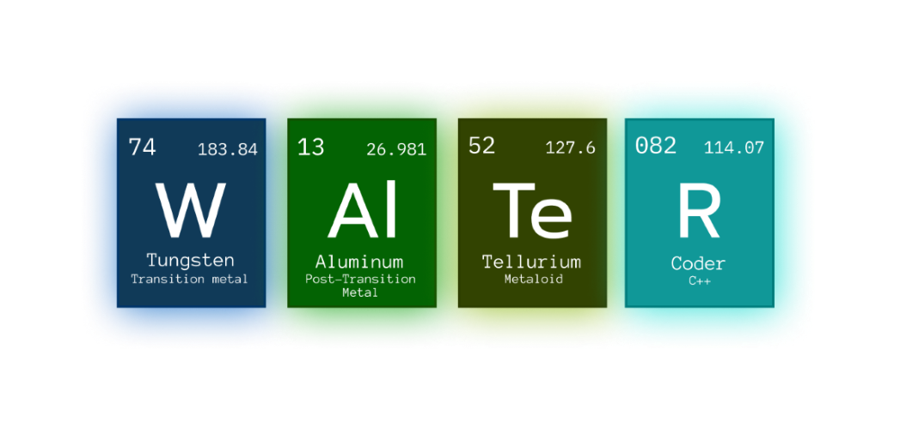

<p align = "center">
  
</p>

<hr>

# 📖 About the game 
<p>Our team decided to make an app where you can learn about different viruses and do little trivia afterwards to see what you have learned! </p>

# 📥 Installation
<p><i>These instructions will help you copy and run our project.</i></p>

## 🕹️ Compile from source
- <p>Prerequisites</p>
```
Code Editor(e.g. Visual Studio)
Git
```

- <p>Installing<p>
<p>1. Clone the repo</p>

```
https://github.com/ADAtanasov21/Walter.git
```
<p>2. Open the .sln file</p>
<p>3. Run the project!</p>

<h1>📄 Documentation</h1>
<h3> ⤠<a href="#">Documentation</a> </h3>
<h3> ⤠<a href="https://github.com/ADAtanasov21/Walter/blob/main/docs/PresentationWalter.pptx">Presentation </a> </h3>
<h3> ⤠<a href="#">QA documentation </a></h3>
<h3> ⤠<a href ="#">Test plan </a></h3>
<h1>💻 Used Technologies</h1>
  
<p> C/C++ - Main Languages</p>
<p> Git - Source Control</big></p>
<p> MS Word - Documentation</p>
<p> MS PowerPoint - Presentation</p>
<p> MS Excel - QA and Test plan</p>

#  🏆 The Team
<p><a href="https://github.com/ADAtanasov21">Atanas Atanasov</a> - Scrum Trainer</p>
<p><a href="https://github.com/ISDelchilov21">Ivan Delchilov</a> - Back-end Developer</p>
<p><a href="https://github.com/NZStoyanov21">Nikolay Stoyanov</a> - Back-end Developer</p>
<p><a href="https://github.com/DKGeorgiev21">Dimitur Georgiev</a> - QA Engineer</p>
